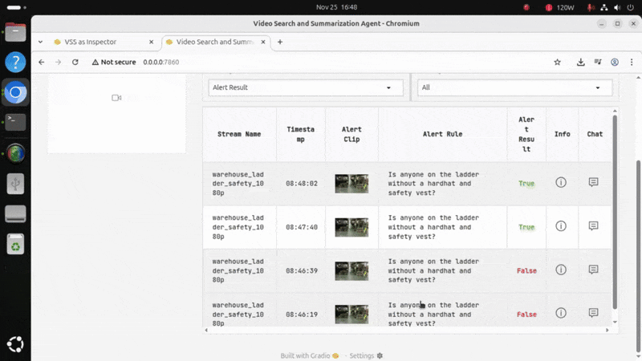

# Video Search and Summarization (VSS)

The NVIDIA VSS (Video Search and Summarization) provides developers with a reference architecture to build and deploy video analytics AI agents on edge devices like the Jetson Thor. 

This system enables contextualized video summarization, Q&A, and real-time alerts by analyzing large quantities of live camera streams and recorded video.

It serves as an enterprise co-pilot to automate the collection and understanding of analytics, acting as an intelligent add-on to existing computer vision pipelines.

## Key Features

- **Core Capabilities**: Summarization, Q&A, Event Verification, and Low Latency Alerts.
- **VLM Integration**: Utilizes the Cosmos Reason 1.1 VLM for advanced reasoning.
- **Event Verification**: Enhances computer vision pipelines by verifying detected events using natural language logic.
- **Edge Deployment**: Optimized for deployment on NVIDIA Jetson Thor.

## System Architecture

The demo consists of two main integrated components:

1. **Computer Vision Pipeline**: Uses DeepStream and GroundDino to detect objects. If the number of objects exceeds a threshold, it outputs a video clip.
2. **VSS (Video Search & Summarization)**: Processes the clips using the VLM to answer user-defined Yes/No questions. These answers are converted into alerts or dashboard insights.

**Workflow**

1. **Detection**: The pipeline finds important events in the video stream.
2. **Reasoning**: VSS processes the clip and answers questions (True/False states).
3. **Insight**: Responses generate low-latency alerts displayed on the web dashboard.

<a href="https://youtu.be/sddRzZQ7aKM"></a>

## Installation Guide

### 1. Prerequisites

Ensure JetPack and Docker are installed.

```bash
# Install JetPack if needed
sudo apt update
echo -e '\nPackage: nvidia-l4t-*\nPin: version 38.2.0-20250821174705\nPin-Priority: 999' | sudo tee -a /etc/apt/preferences.d/nvidia-repo-pin
sudo apt install -y nvidia-jetpack
```

Follow [the guide](https://github.com/advantech-EdgeAI/VSS/issues/2) to install Docker.

### 2. Download Essential Data

Create a directory for the demo and download the required container images and models.

```bash
# Create demo folder
mkdir -p ~/vss_demo_downloads

# Copy data from the shared volume (Example command)
sudo docker run --name share-volume-vss ispsae/share-volume-vss
sudo docker cp share-volume-vss:/data/. ~/vss_demo_downloads

# Load Docker images
docker load -i ~/vss_demo_downloads/alert-inspector-ui.tar.gz
docker load -i ~/vss_demo_downloads/cv-ui.tar.gz
docker load -i ~/vss_demo_downloads/nv-cv-event-detector.tar.gz
docker load -i ~/vss_demo_downloads/via-engine.tar.gz
```

### 3. Setup Demo Environment

Extract the demo scripts and model weights.

```bash
# Extract demo folder
tar -xzf ~/vss_demo_downloads/vss_demo.tar.gz -C ~/

# Extract Cosmos-Reason model
tar -xzf ~/vss_demo_downloads/Cosmos-Reason1.1-7B.tar.gz -C ~/vss_demo/models/
```

Note: Check the `.env` file in `~/vss_demo` to ensure `MODEL_ROOT_DIR` points to the correct path. No change is usually needed if the user is "ubuntu".

## Usage / Quick Start

### Start the Application

Launch the entire pipeline using Docker Compose. Note that the first launch may take 15-20 minutes to fully load.

```bash
cd ~/vss_demo
docker compose up
```

Check your terminal output. When you see `Running on local URL: http://0.0.0.0:7862`, the system is ready.

### Access the Web UI

Two web interfaces are available to interact with the demo:

- **CV UI (Control Pipeline)**: `http://<jetson_ip>:7862/`
    - Use this to generate clips of interest from the input video.
- **VSS UI (Insights & Alerts)**: `http://<jetson_ip>:7860/`
    - Use this to receive VLM-based alerts and ask detailed follow-up questions.