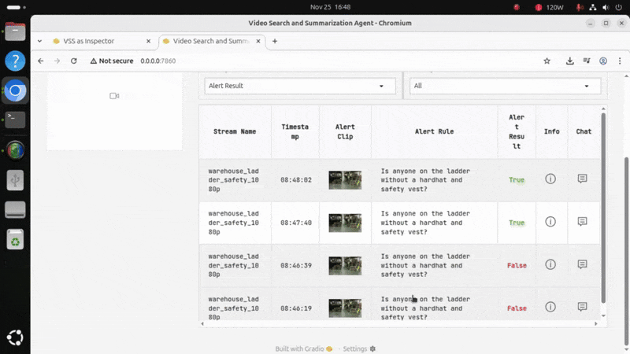

# Video Search and Summarization (VSS)

The NVIDIA VSS (Video Search and Summarization) provides developers with a reference architecture to build and deploy video analytics AI agents on edge devices like the Jetson Thor. 

This system enables contextualized video summarization, Q&A, and real-time alerts by analyzing large quantities of live camera streams and recorded video.

It serves as an enterprise co-pilot to automate the collection and understanding of analytics, acting as an intelligent add-on to existing computer vision pipelines.


## Key Features

- **Core Capabilities**: Summarization, Q&A, Event Verification, and Low Latency Alerts.
- **VLM Integration**: Utilizes the Cosmos Reason 1.1 VLM for advanced reasoning.
- **Event Verification**: Enhances computer vision pipelines by verifying detected events using natural language logic.
- **Edge Deployment**: Optimized for deployment on NVIDIA Jetson Thor.

## System Architecture

The demo consists of two main integrated components:

1. **Computer Vision Pipeline**: Uses DeepStream and GroundDino to detect objects. If the number of objects exceeds a threshold, it outputs a video clip.
2. **VSS (Video Search & Summarization)**: Processes the clips using the VLM to answer user-defined Yes/No questions. These answers are converted into alerts or dashboard insights.

**Workflow**

1. **Detection**: The pipeline finds important events in the video stream.
2. **Reasoning**: VSS processes the clip and answers questions (True/False states).
3. **Insight**: Responses generate low-latency alerts displayed on the web dashboard.

<a href="https://youtu.be/sddRzZQ7aKM"></a>

## Quick Start Guide

### Prerequisites

Ensure JetPack and Docker are installed.

```bash
# Install JetPack if needed
sudo apt update
echo -e '\nPackage: nvidia-l4t-*\nPin: version 38.2.0-20250821174705\nPin-Priority: 999' | sudo tee -a /etc/apt/preferences.d/nvidia-repo-pin
sudo apt install -y nvidia-jetpack
```

Follow [the guide](https://github.com/advantech-EdgeAI/VSS/issues/2) to install Docker.

### Download docker images
Download all docker images at once.

```bash
# run the docker pull scripts
./docker-pull.sh
```

### Start the Application
Go to VSS folder, and bring it up.

```bash
cd local_deployment_single_gpu/
docker compose up
```
Launch the entire pipeline using Docker Compose. 
Note that the first launch may take 5-6 minutes to fully load.

Check your terminal output. When you see the following logs, it shows VSS is ready.
```
via-server-1         | ***********************************************************
via-server-1         | VIA Server loaded
via-server-1         | Backend is running at http://0.0.0.0:8100
via-server-1         | Frontend is running at http://0.0.0.0:9100
via-server-1         | Press ctrl+C to stop
via-server-1         | ***********************************************************
```


### Access the Web UI

Two web interfaces are available to interact with the demo:
- **VSS UI (Full Function Version)**: `http://<jetson_ip>:9100/`

### Stop VSS and Clean out cache data
```bash
ctrl-c # stop vss
docker compose down
sudo ./sys_cache_cleaner.sh
# wait for 5 sec
ctrl-c # exit cleaner
```
